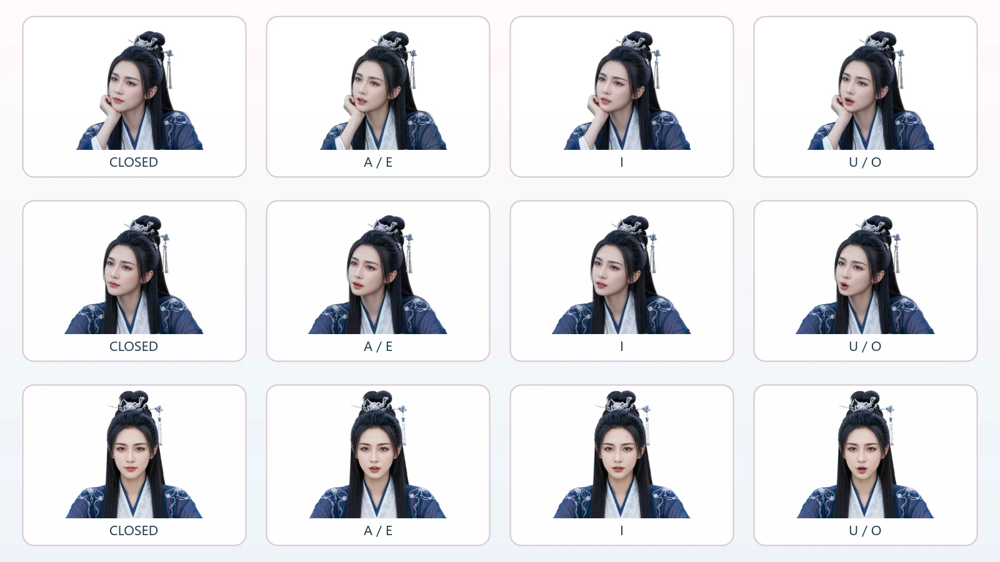
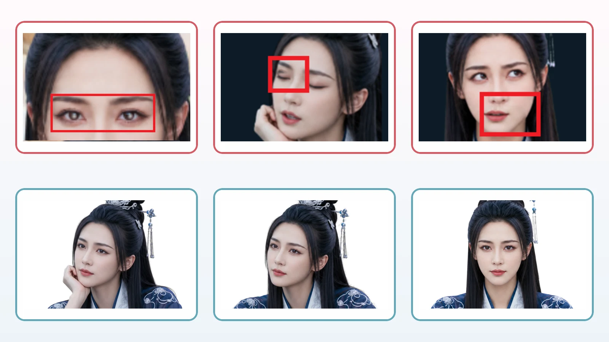

# MoHan Desktop Assistant / 墨寒デスクトップアシスタント

  
  
  
  
  
  
  
  
  

[繁體中文・English](README.md) · [简体中文](README.zh-CN.md) ·
[クイックスタート](QUICKSTART.md) · [セキュリティ](SECURITY.md)

> Windows 10/11 · Python 3.14 · PySide6 · MIT License

墨寒（MoHan）は、安全性、プライバシー、人格の一貫性を大切にする
Windows デスクトップアシスタントです。中国・北宋を生きた千年の女性剣魂を
モチーフに、会話、音声、表情、長期記憶、仕事管理、権限付きツールを一つの
デスクトップキャラクターとしてまとめています。

公開準備中のプレビュー：v2.2.0 RC1（`v2.2.0-rc.1`）

> **クロスプラットフォーム状況：** 実機、全回帰テスト、インストーラー、
> 公開パッケージまで検証済みなのは現在も Windows のみです。macOS／Linux は
> 安全なプラットフォーム境界と、中核インポート・純粋な中核ロジック・Qt
> offscreen の三 OS CI を整備した段階です。`v2.2.0-rc.N` 系列では、起動と
> 四言語表示を確認できる機能限定 DMG／AppImage Preview も提供します。CI を
> 実機互換性や完全機能の証明とは扱いません。
> 詳細は[対応状況と機能表](docs/CROSS-PLATFORM.md)をご覧ください。

> 本プロジェクトは[炎剣オープンソース・ソフトウェア・ファミリー品質基準](PUBLISHING.md)に従います。

## 最新の実機画面

繁体字中国語、簡体字中国語、英語、日本語の README は、同じ最新版画像を
参照します。画面を更新した際に、特定の言語だけ古い画像が残ることを防ぎます。

<table>
  <tr>
    <td width="50%" align="center"> <strong>初回セットアップ</strong></td>
    <td width="50%" align="center"> <strong>Realtime と標準音声</strong></td>
  </tr>
  <tr>
    <td width="50%" align="center"> <strong>表情と動作</strong></td>
    <td width="50%" align="center"> <strong>タスクとアイデア</strong></td>
  </tr>
  <tr>
    <td width="50%" align="center"> <strong>編集可能な長期記憶</strong></td>
    <td width="50%" align="center"> <strong>権限と安全設定</strong></td>
  </tr>
</table>

## このプロジェクトについて

作者の CHOU MING HUA は台湾在住の43歳の父親で、もともとプログラミングの
専門家ではありません。二十年以上抱き続けた「人に寄り添う AI
デスクトップパートナー」への憧れを、Codex と協力しながら実際に動く
オープンソースソフトウェアへ育てました。

墨寒は既存の漫画、アニメ、ゲームを原作とする二次創作ではなく、炎劍文化
工作室（Flameblade Studio）のオリジナルキャラクターとソフトウェアです。

炎劍文化工作室にとってオープンソースとは、最初に「動いた」版を公開し、
細部の後始末を誰かに任せることではありません。墨寒が話している間も同じ
人物に見えるよう、頬杖、寄りかかり、正面の各姿勢に対して、閉口、開口、
横に広がる口、丸い口のフレームを整えました。さらに音声を短い時間単位に
分け、母音、切り替え速度、終了の瞬間を繰り返し調整しています。寄り添う
感覚は、一つの巨大な機能よりも、口を開く、まばたく、少し間を置くという
瞬間に、存在感が壊れないことから生まれると考えているからです。

  

三つの姿勢に一つの口形規格。話すたびに同じ人物としての連続性を守ります。

不自然だったフレームも捨てずに検査しました。白目に残る小さな光、閉じた
まぶたの線、引っ張られすぎた口角、わずか数ピクセルの境界でも、一瞬で
「さっきの墨寒と違う」と感じさせることがあります。問題箇所を囲み、局所
比較し、修正した後、目や唇の変更が顔のほかの部分を壊していないことまで
回帰テストで確認します。

  

欠点を示し、直し、きれいなフレームと自動テストで確認する。数ピクセルにも真剣に向き合います。

この丁寧さは、失敗がなかったように見せるためではありません。本気で一つの
夢を完成させたいからです。炎劍にとってオープンソースとは、自分たちに見える
問題をできる限り直し、その方法、コード、失敗から得た経験を公開し、世界と
ともにさらに鍛えていくことです。**剣は鍛え上げました。この先の道は、
皆さんに託します。**

## 主な機能

- タスクバー上に置ける、透明で枠のないデスクトップキャラクター。
- 呼吸、まばたき、視線、顔の視差、髪、袖、装飾、身体の小さな動き。
- 状況、優先度、クールダウン、重複防止を備えた表情調停。
- AIUEO 母音、子音、音声レベルに連動する口の動き。
- テキスト会話、一回ごとのマイク入力、OpenAI Realtime、音声読み上げ。
- 編集できる長期記憶、タスク、アイデア、作業時間、リマインダー。
- 仕事、お供、集中、会議、離席、休眠モード。
- 危険度、許可リスト、確認、二重確認、監査、緊急停止を備えたツール。
- Windows 間で移動できる単一の `.mohan-profile` ファイル。

## 日本語の対応範囲

`v2.1.0-rc.1` では、日本語の最低限の利用経路を提供します。

- 初回セットアップとプロフィール設定。
- 会話、音声、パソコン権限、基本設定の主要画面と操作。
- 墨寒の日本語人格プロンプトとオフライン応答。
- 仕事モードの台詞、組み込みリマインダー、音声試聴文。
- 日本語文字起こし設定と `ja-JP` 女性音声の優先選択。
- EXE インストーラーの日本語表示と MSI の `ja-JP` 言語変換。

一部の高度な管理画面には台湾繁体字が残る場合があります。画面言語を保存した
後は、墨寒を再起動すると完全に反映されます。現在は再起動なしの言語切り替えを
提供していません。

## 女性音声とオフライン代替

新規ユーザーは Windows 本機音声から始めるため、OpenAI API キーがなくても
基本的な読み上げとオフライン機能を試せます。Windows が女性と明示した
インストール済み音声だけを表示し、日本語では `ja-JP` の女性音声を優先します。
条件を満たす音声がない場合、男性音声へ黙って切り替えず、理由を表示します。

Realtime がオフライン、クラウド音声が失敗、設定が不足、または供給元が不明な
場合も、Windows 本機の女性音声が最初の代替手段です。

## Azure Speech（プレビュー）

Azure Speech は任意で有効にするプレビュー機能です。ご自身の Microsoft Azure
Speech リソースキーと対応リージョンが必要です。キーは Windows DPAPI で別に
暗号化され、データベース、ログ、GitHub には保存されません。

画面には Microsoft が女性と表示する繁体字中国語、簡体字中国語、英語、日本語の
音声だけを掲載します。設定が足りない場合はクラウドへ送信せず、サービス障害時は
同じ文章を一度だけ Windows 女性音声で読み上げ直します。実アカウントでの
エンドツーエンド検証が終わるまでは、安定機能とは表記しません。

## 既定の OpenAI モデル

`v2.1.0-rc.1` から、文字会話の既定モデルは `gpt-5.6-luna` です。設定画面の
選択肢から `gpt-5.4-mini` を外し、既存の mini 設定は Luna へ一度だけ自動移行
します。利用者が明示的に選んだ Terra、Sol、その他のカスタムモデルは上書き
しません。実際の利用可否は OpenAI アカウント、プロジェクト、地域、提供状況に
よって異なります。

## OpenAI API

クラウド AI、OpenAI 音声、Realtime には、利用者自身の OpenAI API キーと
利用可能な残高が必要です。ChatGPT Plus／Pro の契約だけでは API 利用料に
なりません。API キーがなくても、本機データ、オフライン人格、仕事のリマインダー、
Windows 本機音声は利用できます。

## ダウンロードとインストール

1. [GitHub Releases](../../releases) を開きます。
2. 最新の EXE、MSI、または Windows x64 ZIP と SHA-256 を取得します。
3. ハッシュと配布元を確認してから実行または展開します。
4. 初回セットアップで「日本語」を選びます。

署名のないオープンソース候補版は Windows SmartScreen の警告が出る場合が
あります。必ず公式 GitHub Releases と SHA-256 を確認してください。

`v2.2.0-rc.N` 系列は macOS Apple Silicon（arm64）版と Intel（x86_64）版
`.dmg`（各 `.app` 同梱）、および Linux x86_64 `.AppImage` も提供します。
これらは**機能限定 Preview**であり、Windows
完全版と同等ではありません。起動画面、四言語説明、OS ごとの保存先、安全な
無効化境界だけを開放し、音声、透明キャラクター、完全な会話・作業画面、
クラウド連携、システム操作、自動起動、秘密情報入力は実機確認まで無効です。
[Preview 配布物の説明](docs/PREVIEW-PACKAGES.md)を先にお読みください。

### 自動リリースの境界

この系列を公開できるのは、変更しない `v2.2.0-rc.N` タグだけです。Windows
ZIP／EXE／MSI、macOS Apple Silicon／Intel 両アーキテクチャの DMG、Linux
AppImage は各 OS のネイティブ CI で完成品
からの起動検査に合格してから、同じ GitHub プレリリースへ入ります。Pull
Request は短期テスト用成果物だけを保存し、Release を作成しません。公開物には
SHA256SUMS、Windows／Preview 別の CycloneDX SBOM、Windows 更新マニフェスト、
Artifact Attestation、四言語の Release 説明を含めます。

## 安全性とプライバシー

- 会話、長期記憶、タスク、作業記録は初期状態で利用者のパソコンに保存します。
- API キー、OAuth 情報、Home Assistant Token は Windows DPAPI で分離して
  暗号化します。
- 会話や外部文書だけで墨寒の権限を増やすことはできません。
- 危険な操作は確認または二重確認が必要で、ファイル削除は初期状態で禁止です。
- 個人データ、会話記録、秘密鍵を GitHub や公開パッケージへ含めません。

Microsoft、GitHub、Home Assistant の一部統合は、権限境界と自動テストを
備えていますが、すべての実環境での検証は完了していません。該当機能は
実験的プレビューとして扱ってください。

## 開発への参加

必要環境は Windows 10/11 と Python 3.14.x です。まず Issue で相談し、小さく
目的の明確な Pull Request を送ってください。既存機能、安全確認、女性音声の
方針、四言語の最小利用経路を壊す変更は受け入れません。テストがすべて通るまで、
パッケージ化、公開、main への直接反映は行いません。

## ライセンス

プログラム本体は [MIT License](LICENSE) です。キャラクター画像、外部音声モデル、
第三者サービスには別の利用条件が適用される場合があります。コードの MIT
ライセンスが、すべての音声や素材の商用利用を保証するものではありません。

墨寒が気に入った方は、Issue、Pull Request、テスト報告、翻訳改善で参加して
いただけると幸いです。
