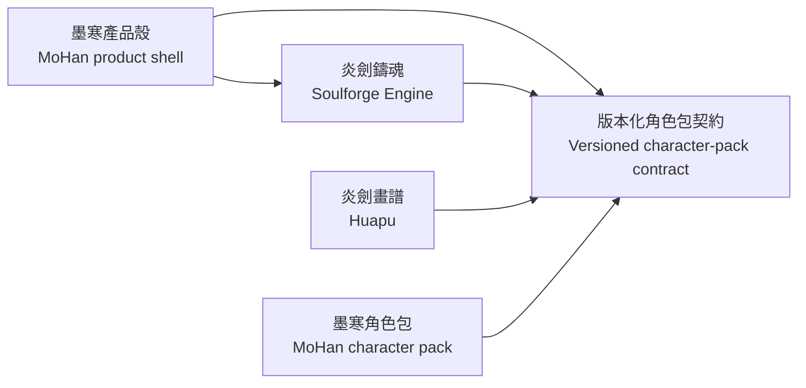

# 炎劍鑄魂模組邊界／炎剑铸魂模块边界／Soulforge Module Boundary／炎剣鋳魂モジュール境界

狀態／状态／Status／状態：E2 依賴方向棘輪基線，2026-10-09 實測／E2 依赖方向棘轮基线，2026-10-09 实测／E2 dependency-direction ratchet baseline, measured 2026-10-09／E2 依存方向ラチェット基準、2026-10-09 実測

權威資料／权威数据／Canonical data／正式データ：[`module-boundary.json`](module-boundary.json)

## 繁體中文

本文件把五個候選套件的 372 個 Python 模組逐一分成引擎 261、墨寒產品殼 51、炎劍畫譜 9、待拆 51。JSON 使用完整 module name，不用 glob；新增、刪除、重複或漏列模組都會使測試失敗。

「引擎」是可移入 Soulforge 的角色中立能力。「墨寒產品殼」保留產品名稱、版本與倉庫、既有安裝資料位置、更新／備份格式、品牌視覺及最外層產品組裝。「炎劍畫譜」是素材稽核、證據與發布前驗證能力。「待拆」代表同檔仍同時擁有引擎與墨寒資料來源，例如直接呼叫 `load_mohan_character_data()` 的相容 facade；資料已外置不等於依賴已中立。

允許方向是墨寒產品殼指向引擎，且引擎與畫譜都可使用版本化角色包契約。禁止引擎匯入墨寒產品殼或畫譜。現況為 70 組引擎→產品殼基線、0 組引擎→畫譜；只准減少。一般 import、`lazy import`、相對 import 與字面值動態 import 套用同一規則。

本包修掉 9 組只為 HTTP／PCM／浮點容差而發生的反向依賴：通用值移入 `domain.core_constants`，`domain.constants` 保留原名相容匯出。另以 `application.service_contracts.CompanionServicesPort` 解除 `companion_core` 對混合式 `service_container` 的直接型別依賴；公開類別、函式與建構簽章不變。

## 简体中文

本文档将五个候选包的 372 个 Python 模块逐一分为引擎 261、墨寒产品壳 51、炎剑画谱 9、待拆 51。JSON 使用完整 module name，不使用 glob；新增、删除、重复或漏列模块都会使测试失败。

“引擎”是可移入 Soulforge 的角色中立能力。“墨寒产品壳”保留产品名称、版本与仓库、现有安装数据位置、更新与备份格式、品牌视觉及最外层产品组装。“炎剑画谱”是素材审计、证据与发布前验证能力。“待拆”表示同一文件仍同时拥有引擎与墨寒数据来源，例如直接调用 `load_mohan_character_data()` 的兼容 facade；数据已外置不等于依赖已中立。

允许方向是墨寒产品壳指向引擎，引擎与画谱都可使用版本化角色包契约。禁止引擎导入墨寒产品壳或画谱。目前有 70 组引擎到产品壳基线、0 组引擎到画谱；只允许减少。普通导入、`lazy import`、相对导入和字面值动态导入使用同一规则。

本工作包修复了 9 组仅因 HTTP、PCM 与浮点容差产生的反向依赖：通用值移入 `domain.core_constants`，`domain.constants` 保留原名兼容导出。另以 `application.service_contracts.CompanionServicesPort` 解除 `companion_core` 对混合式 `service_container` 的直接类型依赖；公开类、函数与构造签名不变。

## English

This document classifies all 372 Python modules in the five candidate packages: 261 engine modules, 51 MoHan product-shell modules, 9 Huapu modules, and 51 pending-split modules. The JSON uses exact module names rather than globs. Adding, removing, duplicating, or omitting a module fails the test.

“Engine” means character-neutral capability that can move into Soulforge. “MoHan product shell” retains product identity, release version and repository, existing installed-data locations, update and backup formats, branded visuals, and outermost product composition. “Huapu” owns asset audit, evidence, and pre-publication validation. “Pending split” identifies a file that still owns both engine behavior and a MoHan data source, including compatibility facades that call `load_mohan_character_data()`; externalized data alone does not make the dependency neutral.

The allowed direction is MoHan product shell to engine, while both engine and Huapu may use the versioned character-pack contract. Engine imports of the MoHan product shell or Huapu are forbidden. The current baseline contains 70 engine-to-shell pairs and zero engine-to-Huapu pairs, and may only decrease. Regular imports, `lazy import`, relative imports, and literal dynamic imports follow the same rule.

This package removes nine reverse dependencies that existed only to obtain HTTP, PCM, or floating-point constants. Neutral values now live in `domain.core_constants`, while `domain.constants` preserves the old public exports. `application.service_contracts.CompanionServicesPort` also removes the direct `companion_core` type dependency on the mixed `service_container`; public classes, functions, and constructor signatures are unchanged.

## 日本語

本書は五つの候補パッケージにある 372 個の Python モジュールを、エンジン 261、墨寒製品シェル 51、炎剣画譜 9、分割待ち 51 に一つずつ分類します。JSON は glob ではなく完全な module name を使用し、モジュールの追加、削除、重複、記載漏れをテスト失敗にします。

「エンジン」は Soulforge へ移せるキャラクター中立の機能です。「墨寒製品シェル」は製品識別、リリース版数とリポジトリ、既存のインストール済みデータ位置、更新とバックアップ形式、ブランド表示、最外層の製品構成を保持します。「炎剣画譜」は素材監査、証拠、公開前検証を所有します。「分割待ち」は一つのファイルがエンジン動作と墨寒データ源の両方を所有する状態であり、`load_mohan_character_data()` を直接呼ぶ互換 facade も含みます。データの外部化だけでは依存は中立になりません。

許可する方向は墨寒製品シェルからエンジンであり、エンジンと画譜はどちらも版管理されたキャラクターパック契約を利用できます。エンジンから墨寒製品シェルまたは画譜への import を禁止します。現在の基準はエンジンから製品シェルへの 70 組、エンジンから画譜への 0 組で、削減だけを許可します。通常 import、`lazy import`、相対 import、文字列リテラルによる動的 import に同じ規則を適用します。

本作業では HTTP、PCM、浮動小数点許容差を得るだけの逆依存 9 組を解消しました。中立値を `domain.core_constants` へ移し、`domain.constants` は従来の公開名を互換再公開します。また `application.service_contracts.CompanionServicesPort` により、`companion_core` から混在した `service_container` への直接型依存を解消しました。公開済みのクラス、関数、コンストラクター署名は変更していません。

## 依賴方向圖／依赖方向图／Dependency direction／依存方向

禁止／禁止／Forbidden／禁止：`Engine → MoHan product shell`、`Engine → Huapu`。

## 本包已修違規／本包已修违规／Violations removed here／本作業で解消した違反

| 匯入者 importer | 原被匯入者 old target | 新被匯入者 new target | 原行號 old line |
|---|---|---|---:|
| `application.gesture_recognizer` | `domain.constants` | `domain.core_constants` | 11 |
| `application.multimodal_fusion_hub` | `domain.constants` | `domain.core_constants` | 8 |
| `application.native_acceleration` | `domain.constants` | `domain.core_constants` | 19 |
| `application.speech_performance` | `domain.constants` | `domain.core_constants` | 8 |
| `domain.pcm_audio` | `domain.constants` | `domain.core_constants` | 9 |
| `domain.safe_error` | `domain.constants` | `domain.core_constants` | 22 |
| `domain.vision_domain` | `domain.constants` | `domain.core_constants` | 7 |
| `integrations.realtime_voice` | `domain.constants` | `domain.core_constants` | 31 |
| `integrations.speech_audio` | `domain.constants` | `domain.core_constants` | 19 |

## 目前違規基線／当前违规基线／Current violation baseline／現在の違反基準

| 匯入者 importer | 被匯入者 imported | 行 line | 原因 reason |
|---|---|---:|---|
| `application.appearance_renderer` | `domain.constants` | 20 | 引擎模組仍直接讀取同時含墨寒角色 binding、素材路徑或校準值的產品常數模組。 |
| `application.behavior_director` | `domain.constants` | 11 | 引擎模組仍直接讀取同時含墨寒角色 binding、素材路徑或校準值的產品常數模組。 |
| `application.outfit_reveal` | `domain.constants` | 13 | 引擎模組仍直接讀取同時含墨寒角色 binding、素材路徑或校準值的產品常數模組。 |
| `application.performance_coordinator` | `domain.constants` | 26 | 引擎模組仍直接讀取同時含墨寒角色 binding、素材路徑或校準值的產品常數模組。 |
| `application.proactive_companion_composition` | `domain.constants` | 23 | 引擎模組仍直接讀取同時含墨寒角色 binding、素材路徑或校準值的產品常數模組。 |
| `domain.affective_state` | `domain.constants` | 17 | 引擎模組仍直接讀取同時含墨寒角色 binding、素材路徑或校準值的產品常數模組。 |
| `domain.engine_capabilities` | `domain.version_info` | 7 | 引擎模組仍直接讀取墨寒產品版本或既有使用者資料目錄識別。 |
| `domain.face_motion` | `domain.constants` | 5 | 引擎模組仍直接讀取同時含墨寒角色 binding、素材路徑或校準值的產品常數模組。 |
| `domain.outfit_pack` | `domain.constants` | 31 | 引擎模組仍直接讀取同時含墨寒角色 binding、素材路徑或校準值的產品常數模組。 |
| `domain.outfit_pack_makeup` | `domain.constants` | 29 | 引擎模組仍直接讀取同時含墨寒角色 binding、素材路徑或校準值的產品常數模組。 |
| `domain.shyness` | `domain.constants` | 20 | 引擎模組仍直接讀取同時含墨寒角色 binding、素材路徑或校準值的產品常數模組。 |
| `infrastructure.active_outfit_overlay` | `domain.version_info` | 34 | 引擎模組仍直接讀取墨寒產品版本或既有使用者資料目錄識別。 |
| `infrastructure.active_outfit_overlay_layers` | `domain.constants` | 12 | 引擎模組仍直接讀取同時含墨寒角色 binding、素材路徑或校準值的產品常數模組。 |
| `infrastructure.complete_halfbody_expressions` | `domain.constants` | 12 | 引擎模組仍直接讀取同時含墨寒角色 binding、素材路徑或校準值的產品常數模組。 |
| `infrastructure.core_hand_regions` | `domain.constants` | 9 | 引擎模組仍直接讀取同時含墨寒角色 binding、素材路徑或校準值的產品常數模組。 |
| `infrastructure.exasperated_candidate_appearance` | `domain.constants` | 14 | 引擎模組仍直接讀取同時含墨寒角色 binding、素材路徑或校準值的產品常數模組。 |
| `infrastructure.exasperated_candidate_assets` | `domain.constants` | 18 | 引擎模組仍直接讀取同時含墨寒角色 binding、素材路徑或校準值的產品常數模組。 |
| `infrastructure.exasperated_face_rendering` | `domain.constants` | 7 | 引擎模組仍直接讀取同時含墨寒角色 binding、素材路徑或校準值的產品常數模組。 |
| `infrastructure.layered_face_assets` | `domain.constants` | 14 | 引擎模組仍直接讀取同時含墨寒角色 binding、素材路徑或校準值的產品常數模組。 |
| `infrastructure.layered_face_calibration` | `domain.constants` | 22 | 引擎模組仍直接讀取同時含墨寒角色 binding、素材路徑或校準值的產品常數模組。 |
| `infrastructure.layered_face_painting` | `domain.constants` | 8 | 引擎模組仍直接讀取同時含墨寒角色 binding、素材路徑或校準值的產品常數模組。 |
| `infrastructure.layered_face_renderer` | `domain.constants` | 24 | 引擎模組仍直接讀取同時含墨寒角色 binding、素材路徑或校準值的產品常數模組。 |
| `infrastructure.layered_full_body_assets` | `domain.constants` | 29 | 引擎模組仍直接讀取同時含墨寒角色 binding、素材路徑或校準值的產品常數模組。 |
| `infrastructure.layered_full_body_complete_expression` | `domain.constants` | 16 | 引擎模組仍直接讀取同時含墨寒角色 binding、素材路徑或校準值的產品常數模組。 |
| `infrastructure.layered_full_body_renderer` | `domain.constants` | 22 | 引擎模組仍直接讀取同時含墨寒角色 binding、素材路徑或校準值的產品常數模組。 |
| `infrastructure.platform_linux` | `domain.version_info` | 8 | 引擎模組仍直接讀取墨寒產品版本或既有使用者資料目錄識別。 |
| `infrastructure.platform_macos` | `domain.version_info` | 7 | 引擎模組仍直接讀取墨寒產品版本或既有使用者資料目錄識別。 |
| `infrastructure.platform_windows` | `domain.version_info` | 9 | 引擎模組仍直接讀取墨寒產品版本或既有使用者資料目錄識別。 |
| `infrastructure.reviewed_pose_motion` | `domain.constants` | 22 | 引擎模組仍直接讀取同時含墨寒角色 binding、素材路徑或校準值的產品常數模組。 |
| `infrastructure.source_bound_garment_visibility` | `domain.constants` | 15 | 引擎模組仍直接讀取同時含墨寒角色 binding、素材路徑或校準值的產品常數模組。 |
| `presentation._dashboard_wardrobe_tab` | `presentation.dashboard_artwork` | 13 | 可重用 presentation 模組仍直接依賴墨寒產品殼的視覺資源、文案或組合模組。 |
| `presentation._dashboard_wardrobe_tab` | `presentation.flagship_theme` | 17 | 可重用 presentation 模組仍直接依賴墨寒產品殼的視覺資源、文案或組合模組。 |
| `presentation.autonomous_outfit_generation_controller` | `application.presentation_ports` | 46 | 引擎 presentation 仍直接依賴含墨寒 profile、語音預設與攜帶檔格式的產品介面聚合。 |
| `presentation.autonomous_outfit_generation_controller` | `domain.constants` | 27 | 引擎模組仍直接讀取同時含墨寒角色 binding、素材路徑或校準值的產品常數模組。 |
| `presentation.companion_core` | `application.presentation_ports` | 30 | 引擎 presentation 仍直接依賴含墨寒 profile、語音預設與攜帶檔格式的產品介面聚合。 |
| `presentation.companion_core` | `domain.constants` | 40 | 引擎模組仍直接讀取同時含墨寒角色 binding、素材路徑或校準值的產品常數模組。 |
| `presentation.companion_core` | `presentation.dashboard_composition` | 93 | 可重用 presentation 模組仍直接依賴墨寒產品殼的視覺資源、文案或組合模組。 |
| `presentation.companion_core` | `presentation.dashboard_window` | 94 | 可重用 presentation 模組仍直接依賴墨寒產品殼的視覺資源、文案或組合模組。 |
| `presentation.companion_core` | `presentation.first_run_wizard` | 96 | 可重用 presentation 模組仍直接依賴墨寒產品殼的視覺資源、文案或組合模組。 |
| `presentation.companion_core` | `presentation.presentation_resources` | 100 | 可重用 presentation 模組仍直接依賴墨寒產品殼的視覺資源、文案或組合模組。 |
| `presentation.companion_proactive` | `application.desktop_presence` | 7 | 引擎 presentation 仍直接依賴墨寒產品 UI 組合橋接。 |
| `presentation.companion_proactive` | `application.presentation_ports` | 12 | 引擎 presentation 仍直接依賴含墨寒 profile、語音預設與攜帶檔格式的產品介面聚合。 |
| `presentation.companion_proactive` | `domain.app_profile` | 28 | 引擎 presentation 仍直接讀取墨寒 identity 與 persona 相容層。 |
| `presentation.companion_proactive` | `domain.constants` | 29 | 引擎模組仍直接讀取同時含墨寒角色 binding、素材路徑或校準值的產品常數模組。 |
| `presentation.companion_speech_emotion` | `domain.constants` | 15 | 引擎模組仍直接讀取同時含墨寒角色 binding、素材路徑或校準值的產品常數模組。 |
| `presentation.companion_voice_phase` | `domain.app_profile` | 5 | 引擎 presentation 仍直接讀取墨寒 identity 與 persona 相容層。 |
| `presentation.dashboard_dialogs` | `application.presentation_ports` | 25 | 引擎 presentation 仍直接依賴含墨寒 profile、語音預設與攜帶檔格式的產品介面聚合。 |
| `presentation.dashboard_dialogs` | `domain.app_profile` | 26 | 引擎 presentation 仍直接讀取墨寒 identity 與 persona 相容層。 |
| `presentation.dashboard_dialogs` | `presentation.presentation_resources` | 33 | 可重用 presentation 模組仍直接依賴墨寒產品殼的視覺資源、文案或組合模組。 |
| `presentation.dashboard_platforms` | `application.presentation_ports` | 24 | 引擎 presentation 仍直接依賴含墨寒 profile、語音預設與攜帶檔格式的產品介面聚合。 |
| `presentation.dashboard_settings_persistence` | `domain.app_profile` | 8 | 引擎 presentation 仍直接讀取墨寒 identity 與 persona 相容層。 |
| `presentation.dashboard_voice` | `application.presentation_ports` | 19 | 引擎 presentation 仍直接依賴含墨寒 profile、語音預設與攜帶檔格式的產品介面聚合。 |
| `presentation.dashboard_voice` | `domain.app_profile` | 31 | 引擎 presentation 仍直接讀取墨寒 identity 與 persona 相容層。 |
| `presentation.dashboard_voice_runtime` | `application.presentation_ports` | 6 | 引擎 presentation 仍直接依賴含墨寒 profile、語音預設與攜帶檔格式的產品介面聚合。 |
| `presentation.dashboard_wardrobe_categories` | `application.presentation_ports` | 9 | 引擎 presentation 仍直接依賴含墨寒 profile、語音預設與攜帶檔格式的產品介面聚合。 |
| `presentation.dashboard_wardrobe_categories` | `presentation.flagship_theme` | 15 | 可重用 presentation 模組仍直接依賴墨寒產品殼的視覺資源、文案或組合模組。 |
| `presentation.dashboard_wardrobe_makeup` | `presentation.flagship_theme` | 25 | 可重用 presentation 模組仍直接依賴墨寒產品殼的視覺資源、文案或組合模組。 |
| `presentation.dashboard_wardrobe_packages` | `application.presentation_ports` | 8 | 引擎 presentation 仍直接依賴含墨寒 profile、語音預設與攜帶檔格式的產品介面聚合。 |
| `presentation.dashboard_wardrobe_preferences` | `presentation.flagship_theme` | 18 | 可重用 presentation 模組仍直接依賴墨寒產品殼的視覺資源、文案或組合模組。 |
| `presentation.dashboard_wardrobe_preview` | `domain.constants` | 29 | 引擎模組仍直接讀取同時含墨寒角色 binding、素材路徑或校準值的產品常數模組。 |
| `presentation.dashboard_wardrobe_preview` | `presentation.dashboard_artwork` | 38 | 可重用 presentation 模組仍直接依賴墨寒產品殼的視覺資源、文案或組合模組。 |
| `presentation.dashboard_wardrobe_preview` | `presentation.presentation_resources` | 37 | 可重用 presentation 模組仍直接依賴墨寒產品殼的視覺資源、文案或組合模組。 |
| `presentation.desktop_companion_status` | `presentation.dashboard_artwork` | 28 | 可重用 presentation 模組仍直接依賴墨寒產品殼的視覺資源、文案或組合模組。 |
| `presentation.flagship.cloud_health` | `presentation.flagship_ui_localization` | 19 | 可重用 presentation 模組仍直接依賴墨寒產品殼的視覺資源、文案或組合模組。 |
| `presentation.flagship.settings_security` | `presentation.flagship_theme` | 62 | 可重用 presentation 模組仍直接依賴墨寒產品殼的視覺資源、文案或組合模組。 |
| `presentation.flagship.settings_security` | `presentation.lingxiao_themes` | 63 | 可重用 presentation 模組仍直接依賴墨寒產品殼的視覺資源、文案或組合模組。 |
| `presentation.flagship.vision` | `application.cloud_vision_ui_bridge` | 20 | 引擎 presentation 仍直接依賴墨寒產品 UI 組合橋接。 |
| `presentation.flagship.workflow_editor` | `presentation.flagship_ui_localization` | 21 | 可重用 presentation 模組仍直接依賴墨寒產品殼的視覺資源、文案或組合模組。 |
| `presentation.profile_transfer_ui` | `application.presentation_ports` | 27 | 引擎 presentation 仍直接依賴含墨寒 profile、語音預設與攜帶檔格式的產品介面聚合。 |
| `presentation.profile_transfer_ui` | `presentation.auxiliary_ui_localization` | 42 | 可重用 presentation 模組仍直接依賴墨寒產品殼的視覺資源、文案或組合模組。 |

行號是 2026-10-09 的證據位置；棘輪身分只使用 importer 與 imported，純移行不會產生假違規。／行号是 2026-10-09 的证据位置；棘轮身份只使用 importer 与 imported，纯移行不会产生假违规。／Line numbers are evidence locations measured on 2026-10-09; ratchet identity uses only importer and imported, so line-only movement is not a false new violation.／行番号は 2026-10-09 に測定した証拠位置です。識別には importer と imported だけを使い、行移動を新規違反と誤判定しません。

## service_container 最小切割／service_container 最小切割／Minimal service_container cut／service_container の最小分割

`application.service_container` 列為待拆：它仍同時組裝角色來源、Qt presentation ports、OS、資料庫、provider、備份、攜帶檔與 updater。本包只新增由 companion UI 消費的窄服務 bundle Protocol，不移動 factory、不改預設建構路徑。／`application.service_container` 列为待拆：它仍同时组装角色来源、Qt presentation ports、OS、数据库、provider、备份、携带文件与 updater。本包只新增由 companion UI 使用的窄服务 bundle Protocol，不移动 factory、不改变默认构造路径。／`application.service_container` is pending split because it still composes character sources, Qt presentation ports, OS, database, providers, backup, profile transfer, and updater. This package adds only a narrow service-bundle Protocol consumed by the companion UI; it does not move factories or change default construction.／`application.service_container` はキャラクター源、Qt presentation port、OS、DB、provider、バックアップ、profile 移行、updater を同時に構成するため分割待ちです。本作業は companion UI 用の狭い service-bundle Protocol だけを追加し、factory や既定構成経路を移しません。

## 建議搬遷順序／建议迁移顺序／Recommended extraction order／推奨移行順序

1. 先把 `domain.constants` 的角色 binding／素材路徑／rig 校準改由 `CharacterSource` 與角色包 contract 注入；通用常數已在本包完成分離。／先将角色 binding、素材路径与 rig 校准改由 `CharacterSource` 和角色包 contract 注入；通用常数已完成分离。／Inject character bindings, asset paths, and rig calibration from `CharacterSource` and the pack contract; neutral constants are already separated.／角色 binding、素材パス、rig 校正を `CharacterSource` と pack contract から注入します。中立定数は分離済みです。
2. 將 engine version 與墨寒 release version 分開，並由產品殼提供不可變版本與 profile 目錄設定；`YanJianStudio/MoHan` 實際路徑保持不變。／分离 engine version 与墨寒 release version，并由产品壳提供不可变版本和 profile 目录设置；实际路径保持不变。／Separate engine version from the MoHan release version and provide immutable version/profile-directory settings from the shell while preserving the actual `YanJianStudio/MoHan` path.／engine 版数と墨寒 release 版数を分離し、実際の `YanJianStudio/MoHan` パスを保って製品シェルから設定を提供します。
3. 拆出中立 application／presentation ports 與產品文案／品牌資源 ports，收斂 dashboard、voice、wardrobe、profile-transfer 的 presentation 反向依賴。／拆出中立 application 与 presentation ports 以及产品文案与品牌资源 ports。／Extract neutral application/presentation ports and product-copy/brand-resource ports to remove dashboard, voice, wardrobe, and profile-transfer reverse dependencies.／中立 application／presentation port と製品文言／ブランド資源 port を分離し、presentation の逆依存を解消します。
4. 把 `service_container` 的角色中立 factory 搬到 engine composition；原模組保留同名公開入口，僅做墨寒殼組裝。／将角色中立 factory 移到 engine composition，原模块保留同名公开入口。／Move character-neutral factories into engine composition, leaving the original public entry point as MoHan-shell composition.／キャラクター中立 factory を engine composition へ移し、元の公開入口は墨寒シェル構成だけにします。
5. 逐一處理 51 個待拆模組，優先替直接載入墨寒 persona、dialogue、voice、rig 的相容 facade 注入 `CharacterSource`。／逐一处理 51 个待拆模块，优先为直接加载墨寒数据的兼容 facade 注入 `CharacterSource`。／Split the 51 pending modules, prioritizing `CharacterSource` injection for facades that directly load MoHan persona, dialogue, voice, or rig data.／51 個の分割待ちを処理し、墨寒 persona、dialogue、voice、rig を直接読む facade への `CharacterSource` 注入を優先します。

## 逐模組清冊／逐模块清单／Per-module inventory／モジュール別台帳

下列清單與 JSON 同步，模組名稱本身不翻譯。／下列清单与 JSON 同步，模块名称本身不翻译。／The list below mirrors the JSON; module names are language-neutral.／次の一覧は JSON と同期し、モジュール名自体は翻訳しません。

### 引擎／引擎／Engine／エンジン（261）

- `application`
- `application.adaptive_character_composition`
- `application.adaptive_character_runtime`
- `application.appearance_ports`
- `application.appearance_renderer`
- `application.appearance_session`
- `application.autonomous_wardrobe_runtime`
- `application.behavior_director`
- `application.body_pose_renderer`
- `application.camera_presence`
- `application.character_framing_app_bridge`
- `application.cloud_vision_runtime`
- `application.flagship_action_runtime`
- `application.flagship_workflows`
- `application.framing_orchestrator`
- `application.full_body_performance_bridge`
- `application.gesture_action_dispatcher`
- `application.gesture_action_router`
- `application.gesture_application_adapter`
- `application.gesture_controller`
- `application.gesture_recognizer`
- `application.gesture_runtime`
- `application.local_visual_intelligence`
- `application.multimodal_controller`
- `application.multimodal_fusion_hub`
- `application.native_acceleration`
- `application.native_rgba_acceleration`
- `application.object_interaction`
- `application.outfit_pack_builder`
- `application.outfit_reveal`
- `application.performance_app_bridge`
- `application.performance_coordinator`
- `application.performance_runtime`
- `application.proactive_companion_app_bridge`
- `application.proactive_companion_composition`
- `application.rgba_compositing`
- `application.self_generating_wardrobe`
- `application.service_contracts`
- `application.speech_performance`
- `application.vision_controller`
- `application.vision_runtime`
- `application.visual_context_fusion`
- `application.visual_perception`
- `application.visual_social_cues`
- `application.wardrobe_appearance_service`
- `application.wardrobe_storage`
- `application.wellbeing_app_bridge`
- `application.wellbeing_reminder`
- `application.wellbeing_runtime`
- `application.workflow_engine`
- `domain`
- `domain._outfit_pack_models`
- `domain.affective_state`
- `domain.affinity_state`
- `domain.air_interaction`
- `domain.appearance_dynamics`
- `domain.audio_acceleration`
- `domain.audio_buffer`
- `domain.autonomous_wardrobe`
- `domain.character_framing`
- `domain.character_pack`
- `domain.character_pack.archive`
- `domain.character_pack.models`
- `domain.character_pack.validation`
- `domain.character_source`
- `domain.cloud_scene_interpreter`
- `domain.companion_animation_contract`
- `domain.companion_proactivity_preferences`
- `domain.core_constants`
- `domain.emotional_resonance`
- `domain.engine_capabilities`
- `domain.expression_system`
- `domain.face_microtiming`
- `domain.face_motion`
- `domain.face_rig`
- `domain.favor_exclusive`
- `domain.flagship_action_models`
- `domain.flagship_action_policy`
- `domain.flagship_safe_intent`
- `domain.framing_context_policy`
- `domain.framing_preferences`
- `domain.gesture_configuration`
- `domain.gesture_intent`
- `domain.immutable_config`
- `domain.language_normalization`
- `domain.lip_sync`
- `domain.lunar_calendar`
- `domain.makeup_eye_states`
- `domain.makeup_mouth_states`
- `domain.openai_vision_authorization`
- `domain.openai_vision_preferences`
- `domain.outfit_generation`
- `domain.outfit_pack`
- `domain.outfit_pack_archive`
- `domain.outfit_pack_assets`
- `domain.outfit_pack_makeup`
- `domain.outfit_pack_store`
- `domain.pcm_audio`
- `domain.performance_preferences`
- `domain.personality_state`
- `domain.prompt_cache`
- `domain.python315_concurrency`
- `domain.qt_image_io`
- `domain.qt_image_pixels`
- `domain.safe_error`
- `domain.safe_error_localization`
- `domain.satiety`
- `domain.scalar_conversion`
- `domain.scene_semantics`
- `domain.shy_gaze`
- `domain.shyness`
- `domain.speech_boundary`
- `domain.sword_soul_resonance`
- `domain.text_normalizer`
- `domain.time_sovereignty`
- `domain.time_utils`
- `domain.vision_domain`
- `domain.vision_provider_contracts`
- `infrastructure`
- `infrastructure.active_outfit_base_clear`
- `infrastructure.active_outfit_overlay`
- `infrastructure.active_outfit_overlay_layers`
- `infrastructure.animated_appearance`
- `infrastructure.appearance_layer_stack`
- `infrastructure.blink_makeup_composition`
- `infrastructure.companion_proactivity_preferences_store`
- `infrastructure.complete_halfbody_expressions`
- `infrastructure.complete_halfbody_renderer`
- `infrastructure.concurrency_tools`
- `infrastructure.core_hand_regions`
- `infrastructure.corrupt_data`
- `infrastructure.db_affection`
- `infrastructure.db_corrupt_data`
- `infrastructure.db_memory`
- `infrastructure.detachable_halfbody_assets`
- `infrastructure.exasperated_candidate_appearance`
- `infrastructure.exasperated_candidate_assets`
- `infrastructure.exasperated_face_rendering`
- `infrastructure.face_assets`
- `infrastructure.face_identity_store`
- `infrastructure.face_renderer`
- `infrastructure.flagship_windows_toolbox`
- `infrastructure.framing_preferences_store`
- `infrastructure.full_body_blink_binding`
- `infrastructure.full_body_display_placement`
- `infrastructure.gesture_configuration_store`
- `infrastructure.gesture_template_store`
- `infrastructure.hand_landmark_provider`
- `infrastructure.image_alpha_regions`
- `infrastructure.layered_face_assets`
- `infrastructure.layered_face_calibration`
- `infrastructure.layered_face_painting`
- `infrastructure.layered_face_renderer`
- `infrastructure.layered_full_body_assets`
- `infrastructure.layered_full_body_complete_expression`
- `infrastructure.layered_full_body_renderer`
- `infrastructure.memory_index`
- `infrastructure.mouth_geometry`
- `infrastructure.multimodal_model_provider`
- `infrastructure.openai_vision_preferences_store`
- `infrastructure.opencv_vision`
- `infrastructure.outfit_core_composition`
- `infrastructure.outfit_layer_cache`
- `infrastructure.outfit_layer_cache_key`
- `infrastructure.outfit_overlay_diagnostics`
- `infrastructure.performance_preferences_store`
- `infrastructure.platform_contracts`
- `infrastructure.platform_linux`
- `infrastructure.platform_macos`
- `infrastructure.platform_windows`
- `infrastructure.portable_import_checks`
- `infrastructure.portable_secret_binding`
- `infrastructure.portable_secrets`
- `infrastructure.portable_sensitive`
- `infrastructure.reviewed_garment_assets`
- `infrastructure.reviewed_garment_overlay`
- `infrastructure.reviewed_pose_motion`
- `infrastructure.reviewed_pose_overlay`
- `infrastructure.secret_store`
- `infrastructure.source_bound_garment_visibility`
- `infrastructure.special_occasion_store`
- `infrastructure.sqlite_safety`
- `infrastructure.wellbeing_reminder_store`
- `infrastructure.windows_tools`
- `integrations`
- `integrations.azure_regions`
- `integrations.azure_voice_catalog`
- `integrations.cloud_connectors`
- `integrations.home_assistant`
- `integrations.openai_fashion_trend_scout`
- `integrations.openai_vision_provider`
- `integrations.realtime_events`
- `integrations.realtime_session`
- `integrations.realtime_speech_output`
- `integrations.realtime_voice`
- `integrations.remote_control`
- `integrations.speech`
- `integrations.speech_audio`
- `integrations.speech_recognition`
- `integrations.speech_unavailable`
- `presentation`
- `presentation._dashboard_wardrobe_tab`
- `presentation.autonomous_outfit_generation_controller`
- `presentation.companion_blink_composite`
- `presentation.companion_blink_runtime`
- `presentation.companion_core`
- `presentation.companion_face_animation_logic`
- `presentation.companion_legacy_frame`
- `presentation.companion_proactive`
- `presentation.companion_speech_emotion`
- `presentation.companion_speech_mask`
- `presentation.companion_speech_queue`
- `presentation.companion_vad_status`
- `presentation.companion_viseme_cue`
- `presentation.companion_voice_phase`
- `presentation.companion_wait_expression`
- `presentation.corrupt_data_ui`
- `presentation.dashboard_dialogs`
- `presentation.dashboard_platforms`
- `presentation.dashboard_settings_persistence`
- `presentation.dashboard_shared`
- `presentation.dashboard_today_memory`
- `presentation.dashboard_voice`
- `presentation.dashboard_voice_runtime`
- `presentation.dashboard_wardrobe_categories`
- `presentation.dashboard_wardrobe_makeup`
- `presentation.dashboard_wardrobe_packages`
- `presentation.dashboard_wardrobe_preferences`
- `presentation.dashboard_wardrobe_preview`
- `presentation.dashboard_wardrobe_status`
- `presentation.desktop_companion_status`
- `presentation.flagship.audit`
- `presentation.flagship.cloud`
- `presentation.flagship.cloud_health`
- `presentation.flagship.companion`
- `presentation.flagship.gesture_editor`
- `presentation.flagship.localization_catalog`
- `presentation.flagship.localization_cloud_home`
- `presentation.flagship.localization_interaction`
- `presentation.flagship.localization_remote_vision`
- `presentation.flagship.localization_security_audit`
- `presentation.flagship.localization_themes`
- `presentation.flagship.localization_workflows`
- `presentation.flagship.oauth`
- `presentation.flagship.planner`
- `presentation.flagship.remote`
- `presentation.flagship.settings_security`
- `presentation.flagship.shared`
- `presentation.flagship.ui_helpers`
- `presentation.flagship.vision`
- `presentation.flagship.workflow_editor`
- `presentation.flagship.workflows`
- `presentation.performance_composition`
- `presentation.profile_transfer_ui`
- `presentation.qt_parent`
- `presentation.service_status_localization`
- `presentation.settings_ui_localization`
- `presentation.theme_pack_ui`
- `presentation.ui_localization_labels`
- `presentation.wardrobe_layout`
- `presentation.wardrobe_turntable`

### 墨寒產品殼／墨寒产品壳／MoHan product shell／墨寒製品シェル（51）

- `application.app`
- `application.application_bootstrap`
- `application.cloud_vision_ui_bridge`
- `application.desktop_presence`
- `application.packaged_self_test`
- `application.presentation_ports`
- `application.preview_app`
- `application.runtime_bootstrap`
- `application.theme_pack_service`
- `domain.app_profile`
- `domain.character_pack.character_data`
- `domain.constants`
- `domain.feature_registry`
- `domain.persona_defaults`
- `domain.theme_pack`
- `domain.theme_retint`
- `domain.theme_session`
- `domain.version_info`
- `infrastructure.app_resources`
- `infrastructure.backup_manager`
- `infrastructure.profile_transfer`
- `infrastructure.update_manifest_signature`
- `infrastructure.updater`
- `presentation.auxiliary_ui_localization`
- `presentation.companion_window`
- `presentation.dashboard_artwork`
- `presentation.dashboard_composition`
- `presentation.dashboard_control_style`
- `presentation.dashboard_settings`
- `presentation.dashboard_shell`
- `presentation.dashboard_theme_materials`
- `presentation.dashboard_window`
- `presentation.first_run_wizard`
- `presentation.flagship`
- `presentation.flagship.control_center`
- `presentation.flagship.home`
- `presentation.flagship.lifecycle`
- `presentation.flagship.overview`
- `presentation.flagship.runtime`
- `presentation.flagship_core`
- `presentation.flagship_theme`
- `presentation.flagship_ui`
- `presentation.flagship_ui_localization`
- `presentation.lingxiao_fonts`
- `presentation.lingxiao_shell`
- `presentation.lingxiao_themes`
- `presentation.lingxiao_tokens`
- `presentation.lingxiao_widgets`
- `presentation.presentation_resources`
- `presentation.preview_app`
- `presentation.updater_ui`

### 炎劍畫譜／炎剑画谱／Huapu／炎剣画譜（9）

- `domain.character_identity_audit`
- `domain.full_body_asset_audit`
- `domain.full_body_asset_evidence`
- `domain.hand_asset_audit`
- `domain.hand_asset_evidence`
- `domain.pose_atlas_audit`
- `domain.pose_atlas_manifest_builder`
- `domain.pose_atlas_release_gate`
- `domain.visible_identity_audit`

### 待拆／待拆／Pending split／分割待ち（51）

- `application.background_agents`
- `application.companion_phrasebook`
- `application.full_body_render_adapter`
- `application.multisensory_interaction`
- `application.proactive_companion_runtime`
- `application.service_container`
- `application.special_occasion`
- `application.wardrobe_service`
- `domain.character_body_profile`
- `domain.character_data_types`
- `domain.character_expression_data`
- `domain.character_full_body_rig`
- `domain.character_pack.character_data_models`
- `domain.character_pose`
- `domain.character_rig_data`
- `domain.character_runtime_data`
- `domain.chronicle`
- `domain.command_parser`
- `domain.contracts`
- `domain.language_support`
- `domain.outfit_pack_official`
- `domain.pose_pack`
- `domain.pose_runtime_loader`
- `domain.sensory_synesthesia`
- `domain.service_status_localization`
- `domain.somniloquy`
- `domain.speech_configuration`
- `domain.speech_providers`
- `domain.wardrobe_intuition`
- `infrastructure.character_source_pack`
- `infrastructure.db`
- `infrastructure.platform_services`
- `integrations.ai_client`
- `integrations.azure_speech`
- `integrations.openai_outfit_generator`
- `integrations.realtime_contracts`
- `integrations.speech_voice_catalog`
- `integrations.speech_windows_synthesis`
- `presentation.companion_blink_brow_guard`
- `presentation.companion_face_animation`
- `presentation.companion_face_assets`
- `presentation.companion_platform`
- `presentation.companion_speech_runtime`
- `presentation.companion_visual_dynamics`
- `presentation.companion_visual_physics`
- `presentation.dashboard_conversation`
- `presentation.dashboard_voice_catalog`
- `presentation.pose_atlas_assets`
- `presentation.ui_localization`
- `presentation.ui_localization_en`
- `presentation.ui_localization_ja`

