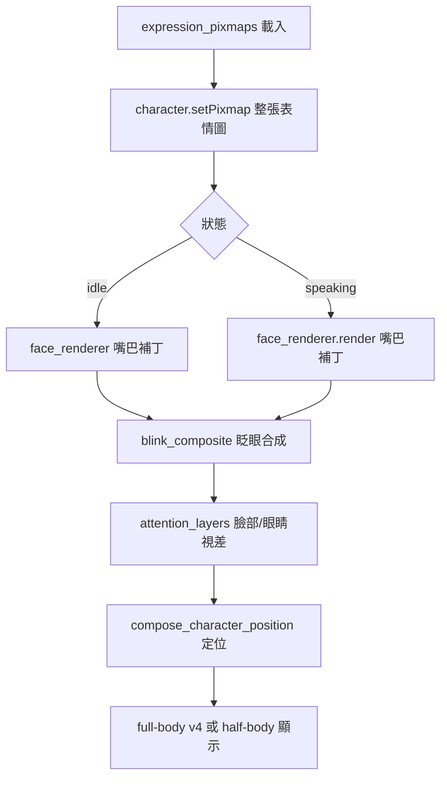

# 分層渲染器正確接入點 — 架構報告

## 1. 結論摘要

`LayeredParametricFaceRenderer`（18 圖層參數化全臉合成）**不應**接入
[`face_renderer_factory`](application/service_container.py:228)，因為兩者的契約本質不同：

| 維度 | `ParametricFaceRenderer`（現役） | `LayeredParametricFaceRenderer`（新） |
|------|----------------------------------|--------------------------------------|
| 契約 | 嘴巴補丁：只改 `base` 的嘴巴 clip 區域，其餘像素與 `base` 完全一致 | 全臉合成：從 18 圖層重繪整張臉 |
| 輸入 | `base`（idle 表情圖）+ `layers`（嘴巴遮罩/來源） | `motion`（`FaceMotionFrame`）+ 自有素材 |
| 輸出尺寸 | 與 `base` 相同（465×465） | 1254×1254（需縮放） |
| 驗證 | [`test_expression_pipeline.py`](tests/test_expression_pipeline.py:291) `assert mouth_outside == 0` | 自有測試 |

直接替換會讓 `test_expression_pipeline.py` 失敗（已實測確認），因為分層渲染器會改變嘴巴區域以外的所有像素。

## 2. 現有渲染流程全景

### 2.1 表情圖載入（整張切換階段）

- [`_build_character_widget`](presentation/companion_visual_dynamics.py:207) 與
  [`_load_expression_assets`](presentation/companion_visual_dynamics.py:168) 從
  `assets/expressions/{expression}.png` 載入**整張**表情圖，縮放到 465×465。
- 表情集合定義於 [`EXPRESSION_IMAGE_ASSETS`](domain/companion_animation_contract.py:98)，
  約 40+ 張（idle/blink/speaking/happy/worried/viseme 等）。
- 這是「整張表情圖切換」的階段，也是分層渲染器**理論上**要取代的階段。

### 2.2 嘴巴補丁階段（face_renderer_factory）

- [`_mouth_aperture_pixmap`](presentation/companion_face_animation.py:869) 呼叫
  `self.face_renderer.render(closed, motion, layers, aperture=...)`。
- 契約：只改嘴巴 clip 區域，其餘像素與 `closed`（idle）一致。
- 由 [`test_expression_pipeline.py`](tests/test_expression_pipeline.py:280) 的
  `assert_neutral_mouth_composition` 強制驗證 `mouth_outside == 0`。

### 2.3 眨眼合成階段

- [`_blink_composite`](presentation/companion_face_assets.py:734) 在嘴巴補丁結果上疊加眨眼。

### 2.4 注意力/視差階段

- [`_render_attention_layers`](presentation/companion_visual_dynamics.py:648) 疊加
  `v120_face` / `v120_eyes` 的視線視差與打光。

### 2.5 全/半身合成階段

- [`_dispatch_adaptive_character_frame`](presentation/companion_core.py:193) 決定
  v4 全身上半身（`_adaptive_full_body_active`）或 legacy 半身。

## 3. 關鍵發現：分層渲染器的正確定位

分層渲染器（18 圖層 × 3 姿態）本質上是**取代「整張表情圖切換」**的渲染器，
而非「嘴巴補丁」。它與現有 `face_renderer_factory` 的關係是：

- `face_renderer_factory` = 在「既有整張表情圖」上做**局部**嘴巴補丁。
- 分層渲染器 = 從零合成「整張臉」，取代「既有整張表情圖」本身。

因此正確的接入點是**表情圖載入/切換階段**（2.1），而非嘴巴補丁階段（2.2）。

## 4. 三個候選接入方案

### 方案 A：新增獨立「全臉合成」port（推薦）

在 `PresentationPorts` 新增一個 `face_composer_factory`（或 `layered_face_renderer_factory`），
與現有 `face_renderer_factory` 並存：

- 保留 `face_renderer_factory`（嘴巴補丁）不動，`test_expression_pipeline.py` 不受影響。
- 新增 port 讓 `companion_visual_dynamics` 在「整張表情圖切換」時改用分層渲染器合成整張臉。
- 優點：契約清晰、可漸進切換、可回滾。
- 缺點：需要新增 port 與對應的合成邏輯，改動較大。

### 方案 B：讓分層渲染器同時實作「嘴巴補丁」契約

讓 `LayeredParametricFaceRenderer.render` 只合成嘴巴區域、其餘沿用 `base`：

- 優點：可直接替換 `face_renderer_factory`，改動最小。
- 缺點：**違背分層渲染器的設計初衷**（它就是要取代整張臉，而非只補嘴巴）。
  且 18 圖層素材是「全臉」素材，硬套嘴巴補丁會浪費其餘 16 層，且嘴巴區域的
  對齊/縮放需與現有 `mouth_clips` 精確匹配，工程複雜且收益低。

### 方案 C：先不接入，保留獨立模組（現狀）

- 保留 `LayeredParametricFaceRenderer` 為獨立模組 + 自有測試。
- 等實機驗收視覺效果後，再決定是否走方案 A 或 B。
- 優點：零風險、不破壞現有契約。
- 缺點：新渲染器尚未在正式畫面生效。

## 5. 建議

**推薦方案 A**，理由：

1. 分層渲染器的價值在於「連續參數化全臉」（眨眼、挑眉、腮紅、嘴巴開合、視線
   全部由 `FaceMotionFrame` 連續驅動），這正是「整張表情圖切換」階段想達成的目標。
2. 現有 `face_renderer_factory` 的嘴巴補丁契約是「局部優化」，兩者服務不同階段，
   不應混為一談。
3. 方案 A 可讓新渲染器在「整張表情圖切換」階段漸進上線，同時保留嘴巴補丁作為
   過渡，風險可控。

### 方案 A 的具體落地步驟（供後續實作參考）

1. 在 [`presentation_ports.py`](application/presentation_ports.py:687) 新增
   `FaceComposerPort` Protocol 與 `FaceComposerFactory = Callable[[], FaceComposerPort]`。
2. 在 [`PresentationPorts`](application/presentation_ports.py:838) 新增
   `face_composer_factory: FaceComposerFactory` 欄位。
3. 在 [`service_container.py`](application/service_container.py:217) 注入
   `face_composer_factory=LayeredParametricFaceRenderer`。
4. 在 [`companion_visual_dynamics.py`](presentation/companion_visual_dynamics.py:207)
   的「整張表情圖切換」處，改用 `face_composer` 合成整張臉（以 `FaceMotionFrame` 驅動）。
5. 保留 `face_renderer_factory`（嘴巴補丁）作為過渡，直到分層渲染器在整張臉階段
   驗證通過後再評估是否移除。

## 6. 待確認事項

- 分層渲染器合成的「整張臉」是否包含身體/頭髮/服裝？目前 18 圖層僅為「臉部五官」，
  不含身體。若要在「整張表情圖切換」階段取代，需確認身體部分如何處理（沿用現有
  半身圖？還是分層渲染器只負責臉部、身體另疊？）。
- 分層渲染器輸出 1254×1254，需縮放到 465×465 才能與現有畫布一致（已在
  `render` 方法加入縮放邏輯，但需確認縮放後五官對齊是否精確）。
